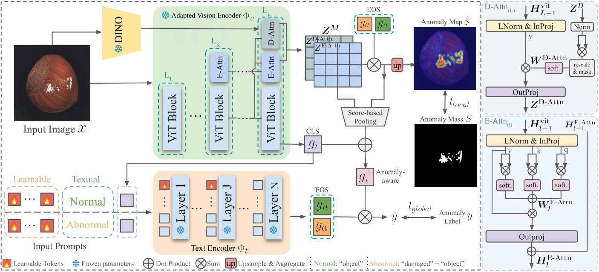
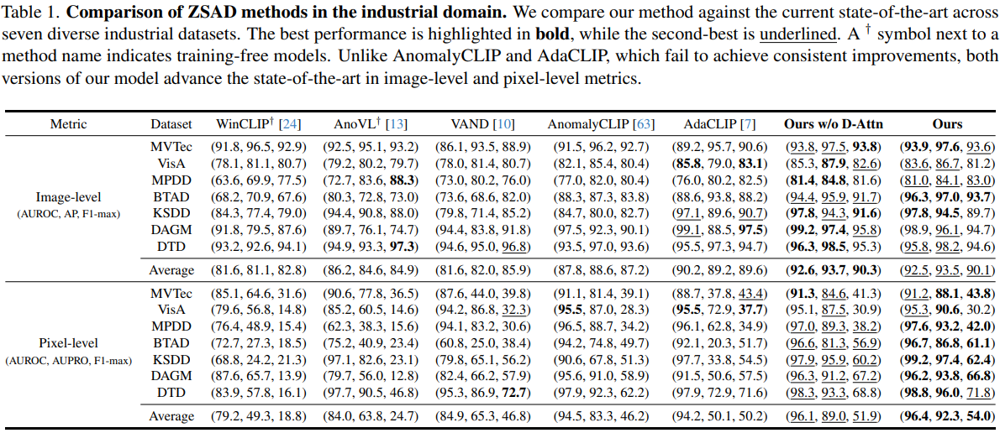
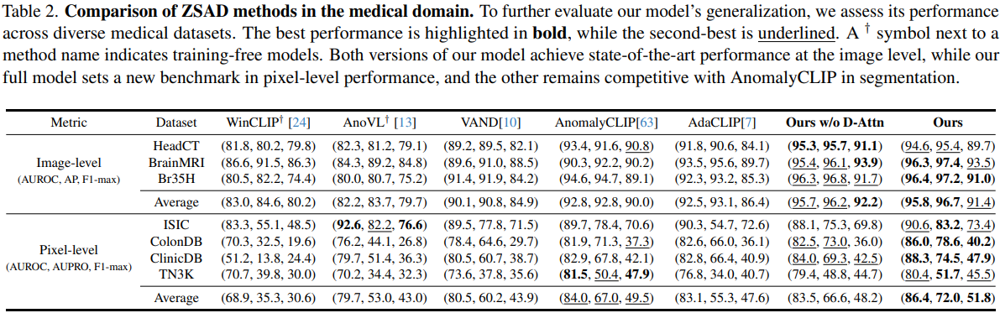
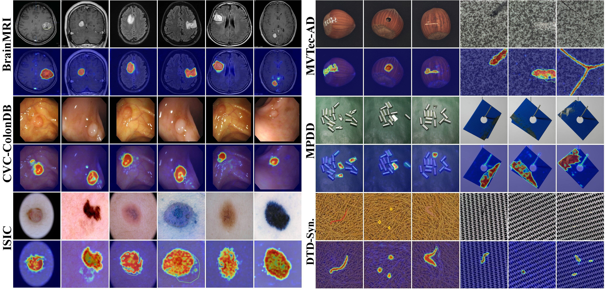

[](https://paperswithcode.com/sota/zero-shot-anomaly-detection-on-mvtec-ad-1?p=crane-context-guided-prompt-learning-and) <br>
[](https://paperswithcode.com/sota/zero-shot-anomaly-detection-on-visa?p=crane-context-guided-prompt-learning-and)

# *Crane*; Robust Novel Anomaly Detector 
The repository contains official code for *Crane*, a zero-shot anomaly detection framework built on CLIP.

---

## 📌 Table of Contents

- [Introduction](#introduction)
- [Results](#-main-results)
- [Visualization](#%EF%B8%8F-visualization)
- [Getting Started](#getting-started)
- [Installation](#-installation)
- [Datasets](#-datasets)
- [Inference](#-inference)
- [Training](#-training)
- [Custom Dataset](#-custom-dataset)

---

## Introduction

Crane is a zero-shot anomaly detection (ZSAD) framework that leverages a pre-trained vision-language model, CLIP, for robust and generalizable anomaly localization. It introduces two attention refinement modules—E-Attn and D-Attn—inserted into the vision backbone to enhance patch-level alignment, fully utilizing the pretrained knowledge, for the zero-shot task. For image-level refinement, Crane adjusts the CLS token to improve global anomaly sensitivity and incorporates a context-guided prompt learning strategy to better model finer-grained anomalies. Together, these components strengthen both image-level and pixel-level detection. Extensive experiments across 14 datasets from industrial and medical domains show that Crane achieves state-of-the-art performance with consistent improvements across multiple evaluation metrics.

<!-- ### Key Features
- Enhancing the sensitivity of global  to anomalous cues for image-level anomaly detection
- Reinforcing patch-level alignment by extending self-correlation attention through E-Attn
- Further improving patch-level alignment using the similarity of DINO features through D-Attn
- Improving auxiliary training generalization through context-guided prompt learning  -->


## Overview



## 📊 Main Results

### Zero-shot evaluation on industrial datasets


### Zero-shot evaluation on medical datasets


## 🖼️ Visualization
### Samples of zero-shot anomaly localization of Crane for both the main setting and the medical setting (discussed in Appendix D). The complete set of visualizations can be found in Appendix of the paper.


## Getting Started
To reproduce the results, follow the instructions below to run inference and training:

### 🧰 Installation
All required libraries, including the correct PyTorch version, are specified in environment.yaml. Running setup.sh will automatically create the environment and install all dependencies.

```bash
git clone https://github.com/AlirezaSalehy/Crane.git && cd Crane
bash setup.sh
conda activate crane_env
```
The required checkpoints for CLIP and DINO checkpoints will be downloaded automatically by the code and stored in `~/.cache`. However, the ViT-B SAM checkpoint must be downloaded manually.
Please download `sam_vit_b_01ec64.pth` from the official Segment Anything repository [here](https://github.com/facebookresearch/segment-anything) to the following directory:
```
~/.cache/sam/sam_vit_b_01ec64.pth
```

### 📁 Datasets
You can download the datasets from their official sources, and use utilities in `datasets/generate_dataset_json/` to generate a compatible meta.json. Alternatively from the [AdaCLIP repository](https://github.com/caoyunkang/AdaCLIP?tab=readme-ov-file#industrial-visual-anomaly-detection-datasets) which has provided a compatible format of the datasets. Place all datasets under `DATASETS_ROOT`, which is defined in [`./__init__.py`](__init__.py). 

### 🔍 Inference
The checkpoints for our trained "default" model are available in [`checkpoints`](/checkpoints/) directory. After installing needed libraries, reproduce the results by running: 
```bash
bash test.sh default "0"
```
Here, `default` refers to the model_name, and `"0"` specifies the CUDA device ID(s).

### 🔧 Training
To train new checkpoints using the default setting, simply run:

```bash
bash train.sh new_model 0
```
where `new_model` and `0` specify the name for the checkpoint and the available cuda device ID.

## ➕ Custom Dataset

You can use your custom dataset with our model easily following instructions below:

### 1. Organize Your Data
Your dataset must either include a `meta.json` file at the root directory, or be organized so that one can be automatically generated.

The `meta.json` should follow this format:
- A dictionary with `"train"` and `"test"` at the highest level
- Each section contains class names mapped to a list of samples
- Each sample includes:  
  - `img_path`: path to the image relative to the root dir
  - `mask_path`: path to the mask relative to the root dir (empty for normal samples)  
  - `cls_name`: class name  
  - `specie_name`: subclass or condition (e.g., `"good"`, `"fault1"`)  
  - `anomaly`: anomaly label; 0 (normal) or 1 (anomalous)

If your dataset does not include the required `meta.json`, you can generate it automatically by organizing your data as shown below and running [`datasets/generate_dataset_json/custom_dataset.py`](datasets/generate_dataset_json/custom_dataset.py):

```
datasets/your_dataset/
├── train/
│   ├── c1/
│   │   └── good/
│   │       ├── <NAME>.png
│   └── c2/
│       └── good/
│           ├── <NAME>.png
├── test/
│   ├── c1/
│   │   ├── good/
│   │   │   ├── <NAME>.png
│   │   ├── fault1/
│   │   │   ├── <NAME>.png
│   │   ├── fault2/
│   │   │   ├── <NAME>.png
│   │   └── masks/
│   │       ├── <NAME>.png
│   └── c2/
│       ├── good/
...     ...
```

Once organized, run the script to generate a `meta.json` automatically at the dataset root.


### 2. Run Testing
Then you should place your dataset in the `DATASETS_ROOT`, specified in [`datasets/generate_dataset_json/__init__.py`](datasets/generate_dataset_json/__init__.py) and run the inference:

```bash
python test.py --dataset YOUR_DATASET --model_name default --epoch 5
```

## 🔒 License
This project is licensed under the MIT License. See the [LICENSE](LICENSE) file for details.


## 📄 Citation
If you find this project helpful for your research, please consider citing the following BibTeX entry.


<!-- 📚 [Paper Link](https://arxiv.org/pdf/2504.11055) -->

**BibTeX:**
```bibtex
@article{salehi2025crane,
  title={Crane: Context-Guided Prompt Learning and Attention Refinement for Zero-Shot Anomaly Detections},
  author={Salehi, Alireza and Salehi, Mohammadreza and Hosseini, Reshad and Snoek, Cees GM and Yamada, Makoto and Sabokrou, Mohammad},
  journal={arXiv preprint arXiv:2504.11055},
  year={2025}
}
```

## Acknowledgements
This project builds upon:

- [AdaCLIP](https://github.com/caoyunkang/AdaCLIP)
- [VAND](https://github.com/ByChelsea/VAND-APRIL-GAN)
- [AnomalyCLIP](https://github.com/zqhang/AnomalyCLIP)
- [OpenAI CLIP](https://github.com/openai/CLIP)
- [ProxyCLIP](https://github.com/mc-lan/ProxyCLIP)

We greatly appreciate the authors for their contributions and open-source support.

---

## Contact
For questions or collaborations, please contact **[alireza99salehy@gmail.com](mailto:alireza99salehy@gmail.com)**.
