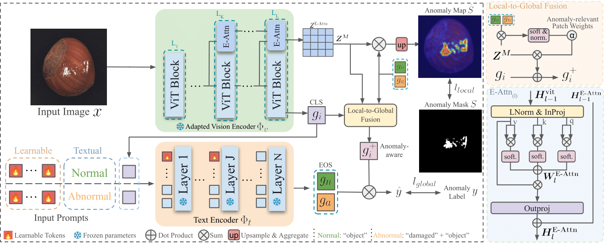

[](https://paperswithcode.com/sota/zero-shot-anomaly-detection-on-mvtec-ad-1?p=crane-context-guided-prompt-learning-and) <br>
[](https://paperswithcode.com/sota/zero-shot-anomaly-detection-on-visa?p=crane-context-guided-prompt-learning-and)

# *Crane*; Robust Novel Anomaly Detector 
The repository official code for *Crane*, a zero-shot anomaly detection framework built on CLIP.

---

## 📌 Table of Contents

- [Introduction](#Introduction)
- [Results](#-main-results)
- [Getting Started](#getting-started)
- [Installation](#-Installation)
- [Datasets](#-datasets)
- [Custom Dataset](#-custom-dataset)
- [Citation](#Citation)
- [Acknowledgements](#acknowledgements)
- [Contact](#contact)

---

## Introduction

Anomaly Detection (AD) involves identifying deviations from normal data distributions and plays a critical role in areas such as medical diagnostics and industrial defect detection. Traditional AD methods typically rely on the availability of normal training samples, However, this assumption is not always feasible, as collecting such data can be impractical, and such methods tend to generalize poorly across domains. Recent advances like AnomalyCLIP and AdaCLIP leverage CLIP’s zero-shot capabilities, yet still suffer from a performance gap between image-level and pixel-level anomaly detection due to CLIP’s weak patch-level alignment, a consequence of lacking patch-level constraints during pretraining. AdaCLIP attempts to address this by introducing trainable parameters into the vision encoder; however, under limited data and zero-shot constraints, this leads to overfitting and a notable drop in pixel-level AUPRO. In contrast, we propose E-Attn and D-Attn modules that enhance patch-level alignment without modifying the vision encoder, thereby fully leveraging CLIP’s pretrained knowledge. Additionally, we refine the CLS token to improve anomaly-aware global representations and introduce a generalized prompt learning strategy. These enhancements deliver consistent gains of 2% to 29% across various metrics on 14 benchmark datasets, achieving state-of-the-art performance in both image-level and pixel-level anomaly detection.

### Key Features
- Enhancing the sensitivity of global  to anomalous cues for image-level anomaly detection
- Reinforcing patch-level alignment by extending self-correlation attention through E-Attn
- Further improving patch-level alignment using the similarity of DINO features through D-Attn
- Improving auxiliary training generalization through context-guided prompt learning 


## Overview



## 📊 Main Results

### Zero-shot evaluation on industrial datasets


### Zero-shot evaluation on medical datasets


## Getting Started
To reproduce the results, follow the instructions below to run inference and training:

### 🧰 Installation
All required libraries, including the correct PyTorch version, are specified in environment.yaml. Running setup.sh will automatically create the environment and install all dependencies.

```bash
git clone https://github.com/AlirezaSalehy/Crane.git && cd Crane
bash setup.sh
conda activate crane_env
```
The required checkpoints for CLIP and DINO will be downloaded automatically by the code and stored in `~/.cache`. However, the ViT-B SAM checkpoint must be downloaded manually.
Please download `sam_vit_b_01ec64.pth` from the official Segment Anything repository [here](https://github.com/facebookresearch/segment-anything) to the following directory:
```
~/.cache/sam/sam_vit_b_01ec64.pth
```

### 📁 Datasets
You can download the datasets from their official sources and use utilities in `datasets/generate_dataset_json/`  to generate a compatible meta.json. Alternatively from the [AdaCLIP repository](https://github.com/caoyunkang/AdaCLIP?tab=readme-ov-file#industrial-visual-anomaly-detection-datasets) which has provided a compatible format of the datasets. Place all datasets under `DATASETS_ROOT`, which is defined in [`./__init__.py`](__init__.py). 

### Inference

```bash
bash test.sh default
```

### Training

```bash
bash train.sh default
```

## ➕ Custom Dataset

You can use your custom dataset with our model easily following instructions bellow:

### 1. Organize Your Data
Your dataset must either include a `meta.json` file at the root directory, or be organized so that one can be automatically generated.

The `meta.json` should follow this format:
- A dictionary with `"train"` and `"test"` at the highest level
- Each section contains class names mapped to a list of samples
- Each sample includes:  
  - `img_path`: path to the image relative to the root dir
  - `mask_path`: path to the mask relative to the root dir (empty for normal samples)  
  - `cls_name`: class name  
  - `specie_name`: subclass or condition (e.g., `"good"`, `"fault1"`)  
  - `anomaly`: anomaly label; 0 (normal) or 1 (anomalous)

If your dataset does not include the required `meta.json`, you can generate it automatically by organizing your data as shown below and running [`datasets/generate_dataset_json/custom_dataset.py`](datasets/generate_dataset_json/custom_dataset.py):

```
datasets/your_dataset/
├── train/
│   ├── c1/
│   │   └── good/
│   │       ├── <NAME>.png
│   └── c2/
│       └── good/
│           ├── <NAME>.png
├── test/
│   ├── c1/
│   │   ├── good/
│   │   │   ├── <NAME>.png
│   │   ├── fault1/
│   │   │   ├── <NAME>.png
│   │   ├── fault2/
│   │   │   ├── <NAME>.png
│   │   └── masks/
│   │       ├── <NAME>.png
│   └── c2/
│       ├── good/
...     ...
```

Once organized, run the script to generate a `meta.json` automatically at the dataset root.


### 2. Run Testing
Then you should place your dataset in the `DATASETS_ROOT`, specified in [`datasets/generate_dataset_json/__init__.py`](datasets/generate_dataset_json/__init__.py) and run the inference:

```bash
python test.py --dataset YOUR_DATASET --model_name default --epoch 5
```

## 🔒 License
This project is licensed under the MIT License. See the [LICENSE](LICENSE) file for details.


## 📄 Citation
If you find this project helpful for your research, please consider citing the following BibTeX entry.


<!-- 📚 [Paper Link](https://arxiv.org/pdf/2504.11055) -->

**BibTeX:**
```bibtex
@article{salehi2025crane,
  title={Crane: Context-Guided Prompt Learning and Attention Refinement for Zero-Shot Anomaly Detections},
  author={Salehi, Alireza and Salehi, Mohammadreza and Hosseini, Reshad and Snoek, Cees GM and Yamada, Makoto and Sabokrou, Mohammad},
  journal={arXiv preprint arXiv:2504.11055},
  year={2025}
}
```

## Acknowledgements
This project builds upon:

- [AdaCLIP](https://github.com/caoyunkang/AdaCLIP)
- [AnomalyCLIP](https://github.com/zqhang/AnomalyCLIP)
- [OpenAI CLIP](https://github.com/openai/CLIP)
- [ProxyCLIP](https://github.com/mc-lan/ProxyCLIP)

We thank the authors for their contributions and open-source support.

---

## Contact
For questions or collaborations, please contact **[alireza99salehy@gmail.com](mailto:alireza99salehy@gmail.com)**.
