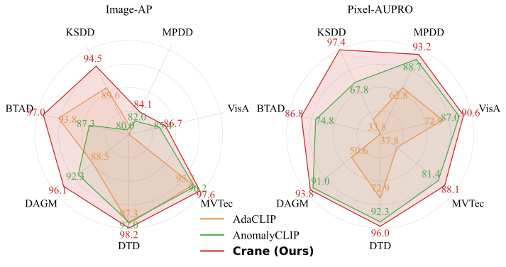
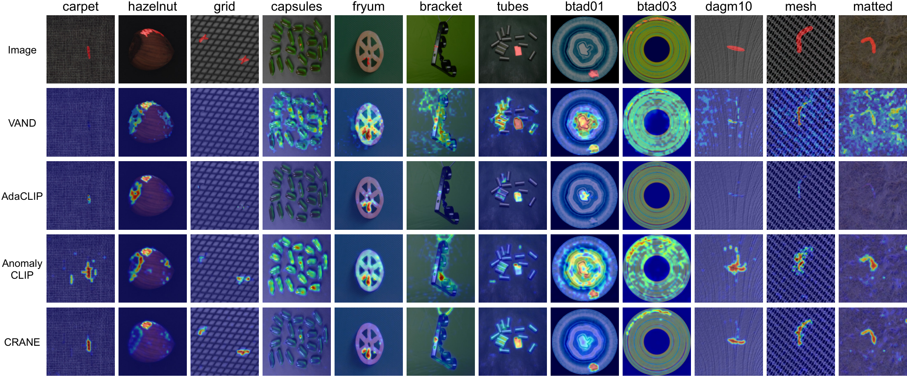

# 🚀 Crane: Context-Guided Prompt Learning and Attention Refinement for Zero-Shot Anomaly Detection

<!-- **Anonymous Authors**  
_(Under Review)_ -->

[📄 Paper (Coming Soon)]() | [💾 Code (Coming Soon)]()

---

## 🔍 Overview

Anomaly Detection (AD) is crucial for medical diagnostics and industrial defect detection. Traditional AD methods rely on normal training samples, but collecting such data is often impractical. Additionally, these methods struggle with generalization across domains.  

Recent advancements like **AnomalyCLIP** and **AdaCLIP** leverage CLIP’s zero-shot generalization but face challenges in bridging the gap between **image-level and pixel-level anomaly detection**.  

🚀 **Crane** improves upon these by:
- **Context-Guided Prompt Learning**: Dynamically conditioning text prompts using image context.  
- **Attention Refinement**: Modifying the CLIP vision encoder to enhance feature extraction for fine-grained anomaly detection.  

Our method **achieves state-of-the-art results**, improving accuracy by **2% to 30%** across **14 datasets**, demonstrating its effectiveness at both **image and pixel levels**.
---

## 📊 Quantitative Comparison with SOTA
Unlike AnomalyCLIP and AdaCLIP, **Crane** consistently improves both localization  and detection, setting new benchmark for zero-shot anomaly detection.

📌 **Image-level AP and pixel-level AUPRO measurements across 7 diverse industrial datasets:**
  


---

## 🖼️ Qualitative Comparison with SOTA
AdaCLIP and VAND struggle to maintain a balance between true positive and false negative rates. AnomalyCLIP further enhances sensitivity but continues to exhibit a high false negative rate, limiting its effectiveness. In contrast, Crane benefits from a stronger semantic correlation among patches, which improves the true positive rate while reducing false positives simultaneously.


📌 **Localization outputs for SOTA models, across various industrial textures and anomalous patterns:**



---

<!-- ## 🔬 Citation
If you find our work useful, please consider citing it:

```bibtex
@article{crane2024,
  title={Crane: Context-Guided Prompt Learning and Attention Refinement for Zero-Shot Anomaly Detection},
  author={Anonymous Authors},
  journal={Under Review},
  year={2024}
} -->